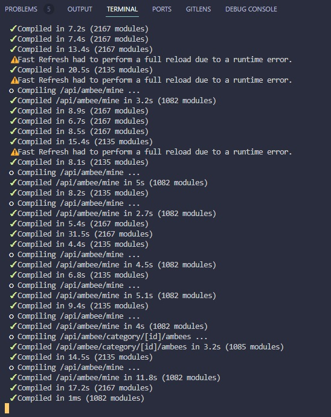
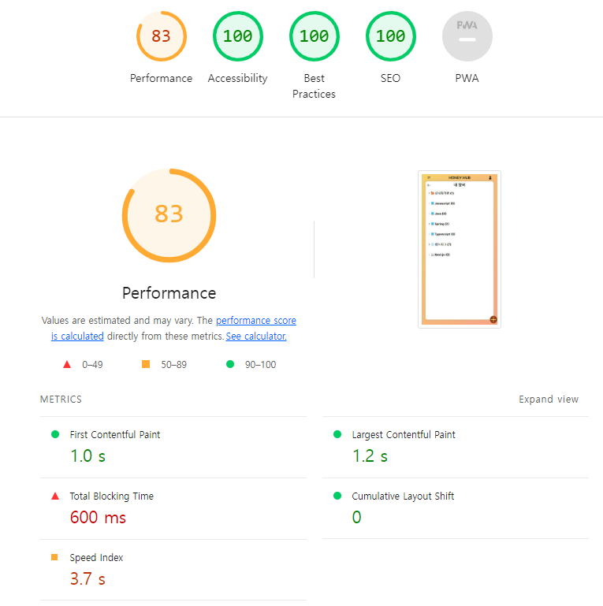

## 회고 (24.04.13)
### 1. 잘한 점
- 익숙한 mui가 아닌, Next.js에 걸맞는 headless ui (from tailwind lab)을 적용했다.
- mui를 걷어낸 이유는 용량이 무겁기도 하고, 빌드 최적화를 하려면 import가 뚱뚱해지는 단점이 있기 때문이다.
- mui를 걷어내는 김에 react-icons도 걷어내고 heros-icons를 적용했다.
- react-icons는 용량이 무려 80MB였고, 빌드 최적화를 하려면 import를 하는 게 귀찮아지는 단점이 있었기 때문이다.

### 2. 배운 점
- Next.js에서는 tailwind css를 사용하는데, mui는 tailwind css를 적용하기가 쉽지 않다는 것을 깨달았다.
- SWC, 터보팩과 같은 빌드 최적화 툴들이 있다.
- lighthouse, @next/bundle-analyzer와 같은 성능 분석 툴이 있고, 이를 사용해봤다.

## 회고 (24.04.12)
### 1. 잘한 점
- 처음 계획한 기본 기능은 얼추 구현이 완료됐다.
- 로딩 스피너, 키보드 컨트롤, 로그인 등 아직 구현해야할 것과 배포까지 생각하면, 해야할 것은 많지만 목표가 가시권이다.
- 빌드 최적화를 했다. 아무리 mac이 아닌 window라고 해도, 프로젝트 크기가 컸으면 얼마나 크다고 10초, 20초 걸리는 게 너무 이상했다.
- 아직 최적화가 모두 완벽하게 된 것은 아니지만, 극단적으로 느리던 것은 해결됐다!

1. 최적화 전  

2. 최적화 후  

### 2. 배운 점
- 서버 컴포넌트와 클라이언트 컴포넌트 개념이 있다. Next.js는 기본적으로 서버 컴포넌트이고, 최상단에 `'use client'`를 작성하여 클라이언트 컴포넌트로 만든다.
- 클라이언트 컴포넌트에 `'use client'`를 붙이기에, 서버 컴포넌트에 `'use server'`를 붙이면 되는 줄 알았지만, 그것은 아니다.
- 기본적으로 최상위 컴포넌트는 서버 컴포넌트다.
- 클라이언트 컴포넌트 하위 컴포넌트들은 일반적으로 모두 클라이언트 컴포넌트로 구성된다.
- 최상위 클라이언트 컴포넌트에만 `'use client'`를 작성하면 된다.
- Next.js 프레임워크를 위와 같이 설계한 데에는 반드시 이유가 있을 것이다. 이를 접하고 났을 때 든 생각은 **'컴포넌트 설계를 진짜 잘해야겠구나'**

### 3. 개선할 점
- React.js와 Next.js를 CSR vs SSR 양면으로만 생각했다. 이제까지 CSR인 React만 해와서, 이번에는 SSR을 해보자! 라고 야심차게 Next.js 14에 입문을 했다.
- 최근 통상적으로 FE와 BE를 분리해서 Spring Boot와 같은 별도의 BE를 두는 것을 생각한다. 하지만, Next.js는 기본적으로 풀스택 프레임워크라고 한다. Next.js는 별도의 BE를 두지 않는 게 일반적이라고 한다. (간단한 로직의 경우)
- Enterprise급 BE가 필요한 경우 분리해서 사용한다.
- 이를 깨달은 시점에서 이 이야기는 매우 청천벽력이었다.
- 이후 **Next.js를 사용할 때는 풀스택 FW로 사용해보자.**
